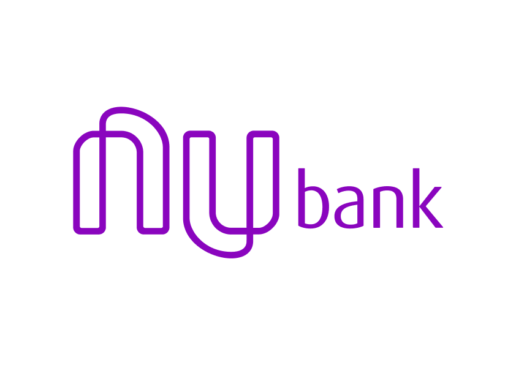
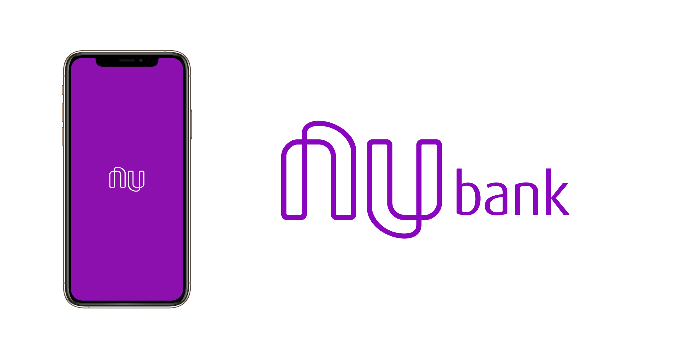

<h1  align="center">

</h1>

	

  
<h4  align="center">
	🌟 Nubank App
</h4>

  

<a  href="#telescope-projeto">🔭 Projeto</a>&nbsp;&nbsp;&nbsp;|&nbsp;&nbsp;&nbsp
<a  href="#computer-tecnologias"> 💻 Tecnologias</a>&nbsp;&nbsp;&nbsp;|&nbsp;&nbsp;&nbsp;
<a  href="#-preview">💜 Preview</a>&nbsp;&nbsp;&nbsp;|&nbsp;&nbsp;&nbsp;
<a  href="#-getting-started">🤠 Getting Started </a>

  

## :telescope: Projeto
 
 Este projeto foi desenvolvido para melhor conhecimento e aplicação das animações utilizando [React Native](https://facebook.github.io/react-native/), a referencia para desenvolver o projeto foi o  [video da RocketSeat](https://youtu.be/DDm0M_rZLJo).

  
  
## :computer: Tecnologias

  
**:iphone: Mobile**
 
- [React Native;](https://facebook.github.io/react-native/)

- [Expo;](https://expo.io/)

- [Styled Components](https://styled-components.com/)
  

## 💜 Preview
 

 

## 🤠 Getting Started

Você precisa clonar o repositório e pode fazer isso digitando em seu terminal `$ git clone https://github.com/Luuck4s/UI-Clone-Nubank.git`.
 

### :iphone: Mobile
  
  
Entre na pasta `$ cd UI-Clone-Nubank/` e execute `$ yarn install` ou `$ npm install`.

Após as dependências terminarem de baixar execute `$ yarn start` ou `$ npm start` e o expo já estará funcionando para você ler o Qr Code e utilizar a aplicação.

--- 

<h5 align="center"> 🚀 Nubank  by Luuck4s 💜 </h5>

---
